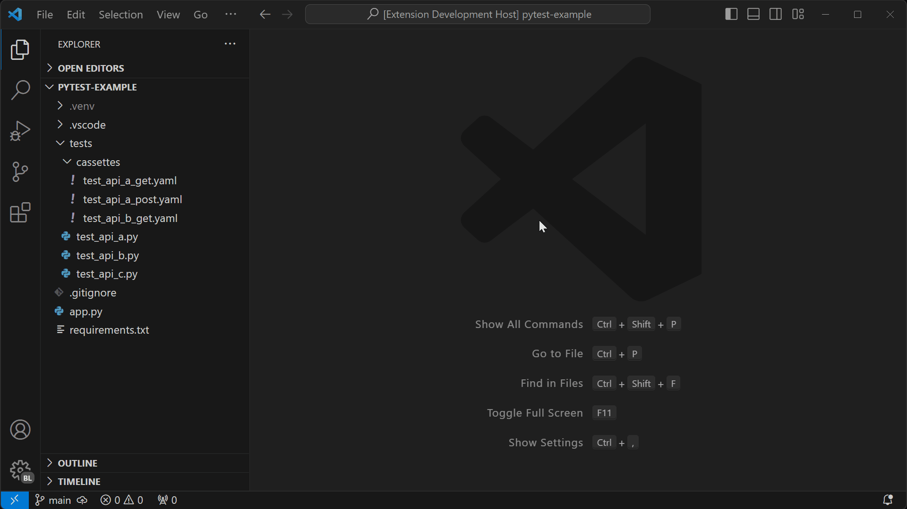

# VCR.py Cassette Manager Extension for Visual Studio Code

Easily open or delete vcrpy cassettes within your tests. Bulk delete cassettes from the current file or the entire workspace.

## Features

- CodeLens buttons above vcr decorators to open or delete cassettes
- Commands:
  - Delete Cassettes in Current File
  - Delete Cassettes in Workspace

## Requirements

* Python language mode must be selected for the active file.
* Only scans for cassettes in files that start with `test_`. (can be changed with `testFileNameStartsWith` setting)
* Cassette names must match their function name.

## Commands

### Delete Cassettes in Current File
Deletes all cassettes in the current file. Asks for confirmation before deleting.

### Delete Cassettes in Workspace
Deletes all cassettes in the current workspace. Asks for confirmation before deleting.

## Extension Settings

* `vcrpy-cassette-mgr.testFileNameStartsWith`: The prefix of your test files. This is used to determine which files are test files and which are not. Defaults to `test_`.
* `vcrpy-cassette-mgr.cassetteDirectoryName`: The name of the directory where your cassettes are stored. The directory will be automatically located in any subdirectories of your workspace. Defaults to `cassettes`.
* `vcrpy-cassette-mgr.vcrDecoratorMatchText`: The text that should be matched to determine if a line is a vcrpy decorator. The default is for pytest, but can be changed to match any decorator such as `@vcr.use_cassette`. Defaults to `@pytest.mark.vcr`.
* `vcrpy-cassette-mgr.deleteConfirmation`: Choose when to confirm before deleting cassettes.. Defaults to `Workspace, Current File, Tests`.
* `vcrpy-cassette-mgr.cassetteButtonOpen`: Show a button in the editor to open the cassette file. Defaults to `true`.
* `vcrpy-cassette-mgr.cassetteButtonDelete`: Show a button in the editor to delete the cassette file. Defaults to `true`.

## Known Issues

None at this time.

## Release Notes

### [1.1.0] - 2023-12-20

New features

- New configuration options:
  - `vcrpy-cassette-mgr.deleteConfirmation`
  - `vcrpy-cassette-mgr.cassetteButtonOpen`
  - `vcrpy-cassette-mgr.cassetteButtonDelete`
- Status bar:
  - Shows the number of cassettes in the current file
  - Warns if the cassette directory is not found
  - Provides quick access to delete commands, rescan directory, and configure extension

### [1.0.0] - 2023-12-15

Initial release

- CodeLens buttons above vcr decorators to open or delete cassettes
- Commands:
  - Delete Cassettes in Current File
  - Delete Cassettes in Workspace